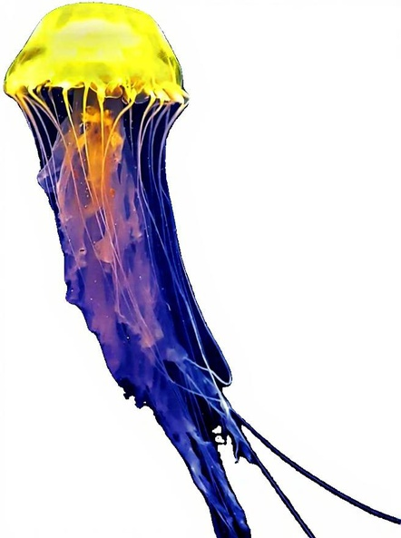

# LAMIC
LAMIC: Layout-Aware Multi-Image Composition via Scalability of Multimodal Diffusion Transformer

## Example of LAMIC (when given 4 reference images and an explicit layout)
|  |  |  |  |
|--------------------------------|----------------------------------------------|
|  |  |
|--------------------------------|----------------------------------------------|
## Framework of LAMIC


This repo contains minimal inference code to run layout-aware multi-image composition & editing with our LAMIC based on Flux.1 Kontext-dev open-source models.

## Local installation
### Install LAMIC
```bash
git clone https://github.com/Suchenl/LAMIC.git
cd LAMIC
conda create --name myenv python=3.10.18
pip install -r requirements.txt
```
### Install underlying foundation model

| Name                        | HuggingFace repo                                               | ModelScope repo                                                       |
| --------------------------- | -------------------------------------------------------------- | --------------------------------------------------------------------- |
| `FLUX.1 Kontext [dev]`      | https://huggingface.co/black-forest-labs/FLUX.1-Kontext-dev    | https://www.modelscope.cn/models/black-forest-labs/FLUX.1-Kontext-dev |

For example, using modelscope
```bash
modelscope download --model black-forest-labs/FLUX.1-Kontext-dev --local_dir ./your_dir
```

## 
