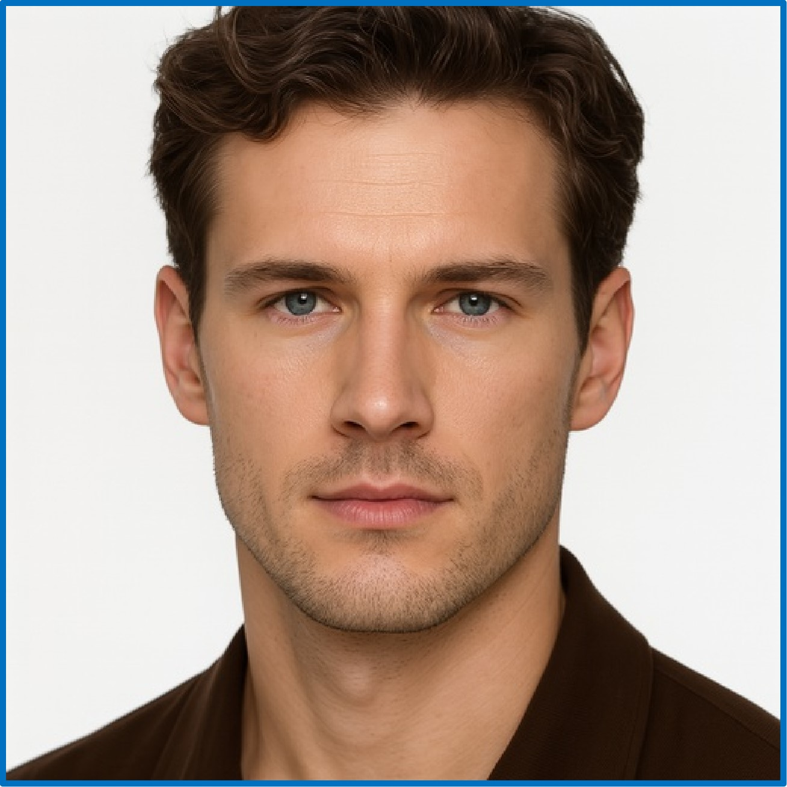

# LAMIC
## LAMIC: Layout-Aware Multi-Image Composition via Scalability of Multimodal Diffusion Transformer

This repo contains minimal inference code to run layout-aware multi-image composition & editing with our LAMIC based on Flux.1 Kontext-dev open-source models.

## An example of LAMIC 

Generate using the same input "example_inputs.json" with four different random number seeds. 

|  |  |  |  |
|--------------------------------|--------------------------------|--------------------------------|--------------------------------|

|  |  |
|--------------------------------|----------------------------------------------|

## Local install
### Install LAMIC
```bash
git clone https://github.com/Suchenl/LAMIC.git
cd LAMIC
conda create --name myenv python=3.10.18
pip install -r requirements.txt
```
### Install underlying foundation model

| Name                        | HuggingFace repo                                               | ModelScope repo                                                       |
| --------------------------- | -------------------------------------------------------------- | --------------------------------------------------------------------- |
| `FLUX.1 Kontext [dev]`      | https://huggingface.co/black-forest-labs/FLUX.1-Kontext-dev    | https://www.modelscope.cn/models/black-forest-labs/FLUX.1-Kontext-dev |

For example, using modelscope
```bash
modelscope download --model black-forest-labs/FLUX.1-Kontext-dev --local_dir ./your_dir
```

## Usage
### Run example
```bash
python batch_run.py --input_path "./example_inputs.json" --num_img_per_sample 4 --concat_per_sample True --flux_kontext_transformer_path "your_local_kontext_transformer_path" --flux_path "your_local_flux_path (flux or flux kontext, both are acceptable)"
```
Of course, you can also refer to example_input to quickly build your own input. The number of reference images is flexible—just try it!

## More refined control (modulate your custom inputs)
### 1. Use your predefined masks for layout control instead of margin boxes
Replace the key "bbox" with "mask_path". 

For example, "mask_path": "your_mask_path (image format)"

### 2. Enhance the impact of one or more of your reference images
If you find that in some cases, the reference performance of some reference images is insufficient, you can try increasing the value of "to_area", which means the area to which the original reference image is scaled in proportion to its length and width. Since LAMIC is based on the attention between tokens, increasing the area of some reference images can increase the number of tokens, thereby enhancing the reference performance of the generated image. Vice versa.

### 3. Reduce the impact of one or more of your reference images on other reference images
In addition to the second method, you can also consider adding the key of "de-overlap" to other reference images, to eliminate the influence of some reference images on other reference images (when the target areas of the two reference images overlap)

For example, "ref_img_4": {"de-overlap": [1, 2]}. This means eliminating the influence of reference image 4 on the overlapping area with reference image 1, and eliminating the influence of reference image 4 on the overlapping area with reference image 2.


## 🚀 Updates
- **[2025.07]** This work is now open source, and you are free to use it!
- **[2025.07]** Technical Report in progress (Expected release: August 2025)


## Framework of LAMIC


## You are free to:
- ✅ Modify, adapt, or build upon the work  
- ✅ Distribute your modified versions  
- ✅ Use for research, education, or production systems  

## 📄 Citation
If you find this work useful to you, please consider citing our paper and giving the repo a ⭐:
```bibtex
@article{chen2025lamic,
  title={LAMIC: Layout-Aware Multi-Image Composition via Scalability of Multimodal Diffusion Transformer}, 
  author={Yuzhuo Chen and Zehua Ma and Jianhua Wang and Kai Kang and Shunyu Yao and Weiming Zhang},
  journal={arXiv preprint arXiv:2508.00477},
  year={2025}
}
